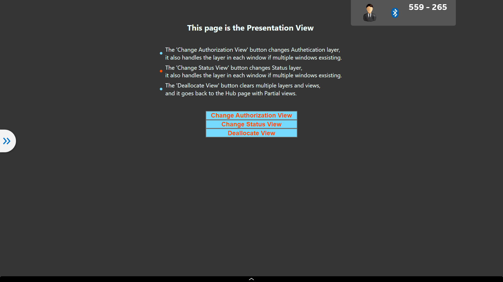
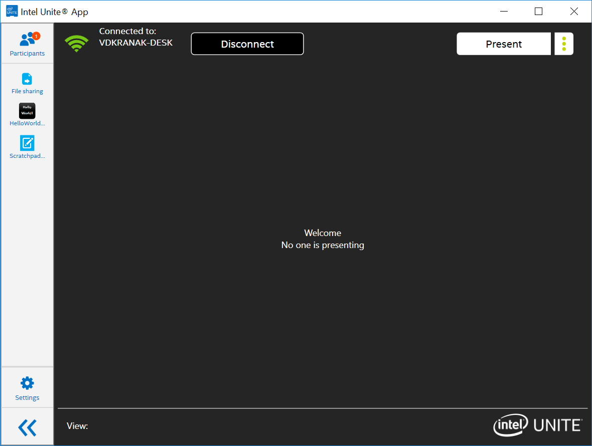
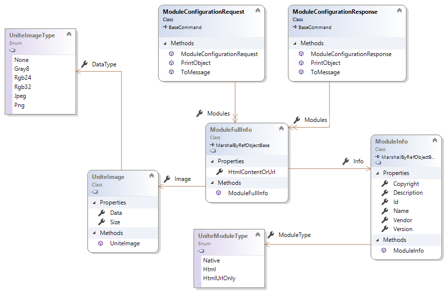

<style type="text/css">
    ol ol{ list-style-type: lower-alpha; }
	.text-block
	{
		text-align: left;
		font-family: arial;
		font-size: 15px;
		font-style: italic;
		padding:20px;
		border: 2px solid red;
	}

	.image-50
	{
		width: 50%;
	}

</style>
Intel Unite® Plugin Software Development Kit (SDK)

Guide

June 2019

Revision 2.0

Intel Confidential

**Legal Disclaimers and Copyrights**

All information provided here is subject to change without notice. Contact your
Intel representative to obtain the latest Intel product specifications and
roadmaps.

Intel technologies' features and benefits depend on system configuration and may
require enabled hardware, software or service activation. Performance varies
depending on system configuration. No computer system can be absolutely secure.
Check with your system manufacturer or retailer or learn more at intel.com.

You may not use or facilitate the use of this document in connection with any
infringement or other legal analysis concerning Intel products described herein.
You agree to grant Intel a non-exclusive, royalty free license to any patent
claim thereafter drafted which includes subject matter disclosed herein.

No license (express or implied, by estoppel or otherwise) to any intellectual
property rights is granted by this document.

The products described may contain design defects or errors known as errata
which may cause the product to deviate from published specifications. Current
characterized errata are available on request.

Intel disclaims all express and implied warranties, including without
limitation, the implied warranties of merchantability, fitness for a particular
purpose, and non-infringement, as well as any warranty arising from course of
performance, course of dealing, or usage in trade.

Intel, the Intel logo, Intel® Core™ vPro™ processor family are trademarks of
Intel Corporation in the United States and/or other countries.

\*Other names and brands may be claimed as the property of others

Contents

1 Introduction 11

Audience 11

Terminology 11

2 Intel Unite® Software Overview 12

The Hub - Intel® Unite™ Hub Application 12

2.1 Authentication Layer 13

2.2 Background Layer 18

2.3 Presentation Layer 20

The Client(s) - Intel® Unite™ Client Application 23

2.4 Plugin Icon Image 24

2.5 Browser Emulator 25

The (PIN) Intel Unite® Server 26

2.6 Admin Portal 26

3 Intel Unite® Software Plugin Module 27

Requirements 27

Runtime Context 27

Events 28

HTML Plugin 28

3.1 HTML Events 28

3.2 HTML Functions 29

4 Code Examples 30

Minimum Plugin Project Setup 30

4.1 Create and Configure a New Unite Plugin Solution in Visual Studio 30

4.2 Implement the HubFeatureModuleBase Abstract Class 36

4.3 Implement ModuleInfo 37

4.4 Implement ModuleManifest 39

4.5 MOVE ME??? Add Post-build Events to Project to Create a *.cab* File and Sign
It 40

5 Add UI Capability To Plugin To Enable Load 42

5.1 Create a QuickAccessAppIconView View 42

5.2 Implement the Load Method 45

6 Package Creation and Deployment 49

Creating and Uploading the Plugin Package 49

7 Developer Notes 52

Logs 52

Commands 54

Tests 56

Troubleshooting 59

7.2 Where is the Intel.Unite.Common.dll? 59

8 Support 60

Figures

Figure 1 - Authentication Layer 9

Figure 2 - Apps View 10

Figure 3 - Icon View 11

Figure 4 - Quick Access Control View 12

Figure 5 - StatusAuth View 12

Figure 6 - Status View 12

Figure 7 - Auth View 13

Figure 8 - Toast Message View 13

Figure 9 - Background View 14

Figure 10 - Partial Background View 15

Figure 11 - Presentation Layer 16

Figure 12 - Presentation View 17

Figure 13 - Ribbon View 18

Figure 14 - Client UI 19

Figure 15 - Client Icon 20

Figure 16 - Browser Emulator 21

Figure 17 - Admin Portal 22

Figure 124 - Project Setup : Step 2 28

Figure 144. Communication Flow from HTML Module to Hub 48

Figure 145. Class Diagram 49

Code

Code 6 - Manifest Generator Tests 52

Code 20. Load Module Tests 54

Revision History

| Revision | Description                                              | Date           |
|----------|----------------------------------------------------------|----------------|
| 1.0      | Initial release                                          | September 2018 |
| 1.1      | Revised Software Overview and Software Plugin Module     | May 2019       |
| 1.2      | Added Minimum Plugin Project Setup                       | May 2019       |
| 1.3      | Added Load Module                                        | June 2019      |
| 2.0      | Modified all sections for clarity and error corrections. | September 2019 |

Introduction
============

Welcome to the *Intel Unite® Plugin Software Development Kit (SDK) Application
Programming Interface (API) Guide*. The Intel Unite® software offers a Plugin
API that provides the ability to incorporate additional business needs and
functionality into Enterprise deployments.

In Section 2, an overview of the Intel Unite® architecture will provide context
to help the developer understand where their Plugin will reside within the Intel
Unite environment, and what it looks like in the Hub and Client User Interfaces.

Sections 4 and higher of this document provides example code that will guide one
to building and deploying Plugins.

Audience
--------

Software developers and anyone looking to develop a plugin for the Intel Unite
application.

For information about deploying Intel Unite®, refer to the Intel Unite®
Deployment Guide.

Terminology
-----------

| Term      | Description                                                                                                                                                                                                           |
|-----------|-----------------------------------------------------------------------------------------------------------------------------------------------------------------------------------------------------------------------|
| UI        | User Interface                                                                                                                                                                                                        |
| WPF       | Windows\* Presentation Foundation                                                                                                                                                                                     |
| Hub       | An Intel® vPro™-based Computer or Device running the Intel Unite® Hub Application and is connected to the same network as the Client(s).                                                                              |
| Client(s) | Any computer, or device running the Intel Unite® Client application and is connected to the Hub on the same network. There may be many Clients connected to the hub.                                                  |
| Server    | Also known as the PIN Server, is a computer that manages access and configuration of the Hub and all Client Devices. A Server may reside On Premises (On Prem), or on the Cloud (not sharing a LAN with a Unite Hub). |

Intel Unite® Software Overview
==============================

The Intel Unite® solution lets you easily create and manage a secure
content-sharing and collaboration platform for your organization. Wirelessly
connect displays, employees, and mixed technology environments so your team can
share and collaborate seamlessly, wherever they are.

For Developers, a powerful, core feature is that with minimal effort, any WPF
program can be adapted to integrate (plugin) to the Intel Unite® application.

The three main Components of the Intel Unite® application are the Hub, the
Client(s), and the (PIN) Server. Following is a drill down of the applications
that run on the Hub and Client(s). The PIN Server is beyond the scope of this
guide, and therefore no drill-down will be provided other than a brief overview
in the Server Section of this document.

### The Hub Application

The Hub Application hosts the Plugins and allows them to communicate with
peripherals. User interaction with the Hub Application is provided via three UI
layers: Authentication, Background, and Presentation.

#### Authentication Layer

The Authentication Layer contains three sub-views that overlay all other views
including any that a Plugin may render. They are the:

-   **Quick View**

-   **StatusAuth View**

-   **Toast Message View**

>   The Authentication Layer will always show the StatusAuth view - which shows
>   the current session PIN and other status information, the chevron button -
>   so that navigation from Quick View is always available, and, if an incoming
>   message event occurs, the Toast Message View - which is momentarily visible.

**Figure 1 - Authentication Layer**

<!---->


#### Quick View Layer

The Quick View Layer has two views, **App View** and **Participants View**, that
provide easy access to important session information and are revealed by
clicking: **\>\>**, or toggled to hide, by clicking: **\<\<**.

>   **App View**: shows all Apps (Plugins) available for the current session and
>   automatically manages their display states, full screen or minimized, for
>   example.

>   **Participants View**: displays an icon representation of each Participant
>   attending the current session.

#### Participant View

The **Participant View** is out of scope of this document and will not be
referenced further.

#### Apps View

Once a Plugin View has been displayed, it cannot be removed from the Apps View.

The App View contains the Icon View and

**Figure 2 - Apps View**

<!---->


### Icon View 

The **Icon View** displays the Plugin icon and is intended to manage the running
of the Plugin with a Click event.

**Figure 3 - Icon View**

<!---->

##### Quick Access Control View

This view contains Plugin Controls and information, and persists until another
Quick Access Control View is displayed or the X is clicked

**Figure 4 - Quick Access Control View**

<!---->


#### StatusAuth View

The StatusAuth View (Figure 5) holds the Status and Auth Views, both explained
in detail below. It resides in the upper-right corner of the Authentication View
and is always visible.

**Figure 5 - StatusAuth View**

<!---->


##### Status View

A grid of icons.

**Figure 6 - Status View**

<!---->


##### Auth View

The Auth View can contain a single icon if it is allocated.  It will always contain the PIN information. The PIN number is
renewed frequently, causing this View to be overwritten.  If an icon was already present when a a new icon is allocated the old icon is overwritten.

**Figure 7 - Auth View**

<!---->


#### Toast Message View

The Toast Message View (Figure 8) provides a way for Unite to communicate
messages of interest to User(s). Messages will display for a brief period before
auto-hiding. Messages are sent from Plugins and by the Unite Core.

**Figure 8 - Toast Message View**

<!---->


### Background Layer

The Background Layer is displayed behind all other layers. The Background View
and Partial Background View are part of this layer. The Background Layer can be
hidden programmatically by a Plugin when the PIN Server is configured to enable
that feature, or by clicking the Desktop button which can be exposed by another
setting in the PIN Server. If the Background Layer is hidden, the Background
View and all Partial Background Views are also hidden.

#### Background View

This View (Figure 9) is shown after Unite is loaded.

**Figure 9 - Background View**

<!---->


#### Partial Background View

The Partial Background Views contain Controls that are always added on top of
the Background View. There is no limit to the number of Partial Background Views
that can be added. When added, each Partial Background View is wrapped in order
of its allocation.

**Figure 10 - Partial Background View**

<!---->


### Presentation Layer

The Presentation Layer can contain up to four Presentation Views and their
associated Ribbon View. This Layer is shared/shown to all Unite Clients.

**Figure 11 - Presentation Layer**

<!---->


#### Presentation View

The Presentation View exposes content of a Plugin’s own Presentation Layer as
shown in Figure 12.

**Figure 12 - Presentation View**

<!---->


#### Ribbon View

Optional on Screen Controls for a Presentation View are contained in a Ribbon
View (Figure 13). A Ribbon View that has been associated to a Presentation View
will be visible only when that Presentation View has focus.

**Figure 13 - Ribbon View**

<!---->


The Client(s) - Intel® Unite™ Client Application
------------------------------------------------

The Client Application User Interface consists of two main parts:

-   The User Interface on the devices connecting the hub. There are two part of
    the Client UI:

    -   The Plugin Icon

    -   The Browser Emulator

**Figure 14 - Client UI**

<!---->


### Plugin Icon Image

The Image that launches HTML for the Plugin.

**Figure 15 - Client Icon**

<!---->


### Browser Emulator

HMTL from the Plugin that interacts with the Hub through exposed events and
functions.

Note: Full browser functionality is limited due to security constraints.

**Figure 16 - Browser Emulator**

<!---->


The (PIN) Intel Unite® Server
-----------------------------

The Device used to administrate Intel Unite. This can be a Cloud Service or an
on-premises Server. The Server hosts an Admin Portal used to configure Unite.

### Admin Portal

The web page that is used to access the features of Intel Unite® Server

**Figure 17 - Admin Portal**

<!---->


Intel Unite® Software Plugin Module
===================================

Requirements
------------

The Intel Unite® solution is developed using the **Microsoft\* .NET\*
Framework** and is built as a combination of distinct components that can be
invoked individually.

The following requirements must be met for Intel Unite® software Plugin modules:

-   A Plugin module must be packaged as a .cab file using the Intel Unite®
    Manifest Generator Tool

-   Cab files must be signed

-   The Project must Include a reference to Intel.Unite.Common.dll

-   A class must be created and implemented that inherits from the abstract
    class Intel.Unite.Common.Module.Feature.Hub.HubFeatureModuleBase

-   The class must have a constructor implementing the base class which takes no
    arguments

-   The class must have a constructor implementing the base class which takes an
    IModuleRuntimeContext variable.

-   The Plugin module must implement constants in the properties ModuleInfo and
    ModuleManifest

Runtime Context
---------------

The Runtime Context lets the Unite Core know which Managers that the Plugin can
use. The Managers are:

-   **CalendarManager**—Exposes information about the Calendar

-   **CommandManager**—Enables the Plugin to interact with the command’s
    functionality - the command refers to a message that is process by the Hub

-   **ConfigurationManager**—Enables the Plugin to obtain configuration
    properties

-   **LafManager (Look and Feel Manager)**—Exposes common UI properties, such as
    primary color, primary font, and so forth

-   **LogManager**—Enables the Plugin to log messages

-   **MessageSender**—Enables the Plugin to send messages, using TLS, from
    Client to Hub

-   **NotificationManager**—Enables the functionality for using native
    notifications

-   **TelemetryManager**—Enables the Plugin to log telemetry events

Events
------

Several events notify Plugins. The events are fired when a User performs a
specific action, as indicated:

-   **UserConnected**—User connects

-   **UserInfoChanged**—User information changes

-   **UserDisconnected**—User disconnects

-   **HubConnected**—Hub connects

-   **HubInfoChanged**—Hub information changes

-   **HubDisconnected**—Hub disconnects

-   **IncomingMessage**—New message available for the Plugin module

-   **SessionKeyChanged**—Session key changes, such as LockStatus,
    ModerationMode, and so forth

HTML Plugin
-----------

The HTML Plugin is a Hub Plugin that exposes an HTML interface in the Client
UIs. This Plugin is multiplatform. The same Client implementation can be used by
any platform that supports HTML. The HTML Plugin runs on a web browser emulator,
which means the browser functionality is not fully supported due to security
reasons. For example, browser developer tools are not allowed. In Windows, the
web browser component supports versions IE7 through IE 11.

This interface allows interaction to occur between a Client and the Hub. Several
events and functions are exposed to the Plugin (refer to the code examples,
later in this document). The events and functions are described in the next
sections.

### HTML Events

HTML events should be defined by developers in the HTML Content property. Events
fire according to specific actions, as follows:

-   **onUserConnected**—User connects

-   **onUserInfoChanged**—User information changes

-   **onUserDisconnected**—User disconnects

-   **onMessage**—A new message is available for the Plugin

-   **onModerationModeUpdated**—Moderation mode changes

-   **onLockSession**—Session is locked

-   **onUnlockSession**—Session is unlocked

-   **sessionKeyChanged**—Session key changes (for example, LockStatus,
    ModerationMode, and so forth)

-   **showScreenSharingCallback**—Result of showScreenSharing function
    indicating a call is ready

### HTML Functions

Functions are defined in the IntelUnite.Js library. This library is injected by
the Hub in the HTML Content property. Some function examples include the
following:

-   **getContext**—Exposes context information to the Plugin (for example, a
    list of Users/Hubs connected with properties like name, email, ID, lock
    status, and so forth)

-   **getTheme**—Exposes common UI properties, like primary color, primary font,
    and so forth

-   **logMessage**—Enables Plugins to log messages

-   **logTelemetryEvent**— Enables Plugins to log telemetry events

-   **sendMessage**— Enables Plugins to send messages

-   **setNumberNotification**— Enables Plugins to update the notification number
    shown in the menu button

-   **showScreenSharing**— Enables Plugins to show the common screen sharing
    dialog

-   **updateToolMenu**— Enables Plugins to update information of the tool menu
    button associated with the Plugin

File manager functions are used to handle file creation, save a screen shot,
save files, and so forth. File manager functions include the following:

-   **closeFile**—Closes the stream and saves the file

-   **createFile**—Initializes the stream for file creation

-   **deleteFile**—Deletes the file that was created with the identifier
    generated by createFile

-   **getFileTransferConfiguration**—Gets the file transfer configuration from
    the client

-   **openFolder**—Opens the file’s folder location o

-   **writeToFile**—Adds bytes to the stream in the client (the stream is
    initialize when createFile is executed)

Code Examples
=============

### Minimum Plugin Project Setup

The basic setup necessary to upload an Intel Unite® Plugin to the Admin portal.

Requirements:

-   Visual Studio

-   Windows 10

-   Windows 10 SDK

-   Intel Unite® Manifest Generator

    1.  Create and Configure a New Unite Plugin Solution in Visual Studio

1.  **In Visual Studio (Figure 123):** Select File -\> New -\> Project  

**Figure 123 - Project Setup : Step 1**
<!---->


1.  **Choose framework (Figure 124):** Select Class Library (.Net Framework -
    Visual C\#) -\> Name: UnitePlugin -\> OK

**Figure 124 - Project Setup : Step 2**

<!---->


1.  **Rename Class1.cs (Figure 125): I**n the Solution Explorer: Select
    Class1.cs -\> F2 -\> type: *PluginModuleHandler.cs* -\> Enter -\> YES (on
    popup dialog) - \> Enter.

**Figure 125 – Project Setup : Step 3**
<!---->

<!---->


1.  **Add References (Figure 126)**: In Solution Explorer right-click on
    References, then from the drop-down menu select: **Add Reference**… . The
    Reference Manager is then displayed.

<!---->

{: .image-50}


**Figure 126 - Project Setup : Step 4**

1.  From the Reference Manager: Click **Assemblies** -\> Framework, then ensure
    only the following are checkmarked:

-   Microsoft.CSharp

-   System

-   WindowsBase

**Figure 127 – Project Setup : Step 5**

<!---->


1.  While still in the Reference Manager: Click **Browse**, then ensure only the
    following are checkmarked:

-   Intel.Unite.Common.dll

    -   If this dll is not visible in the list, see the Troubleshooting Section:
        “Where is the Intel.Unite.Common.dll?”.

**Figure 128 – Project Setup : Step 6**

<!---->


**1.  Click OK.**

### Implement the HubFeatureModuleBase Abstract Class

Important: *All Plugins must implement the HubFeatureModuleBase abstract class.*

>   Implement the HubFeatureModuleBase base class in the derived class
>   PluginModuleHander, as follows (Figure 129):

1.  **Edit class definition:** In the editor, add *public* and ‘*:
    HubFeatureModuleBase’* to *class PluginModuleHandler* resulting in:

    *public class PluginModuleHandler : HubFeatureModuleBase*

2.  **Add Intel reference to PluginModuleHandler class:** In the editor,
    highlight the *HubFeatureModuleBase* added in the previous step -\>
    Alt-Enter  
    -\> click on *using Intel.Unite.Common.Module.Feature.Hub* from the popup
    dialog. This will be added in the “*using*” section.

3.  **Populate with HubFeatureModuleBase abstract class methods:** Once again,
    highlight HubFeatureModuleBase -\> Alt-Enter -\> click on *Implement
    Abstract Class*. Fifteen methods of the HubFeatureModuleBase abstract class
    is automatically added. Figure 129 shows what the Project looks like up to
    this point.

**Figure 129 – Implement Abstract Class : Steps 1 thru 3 Completed**

<!---->


1.  **Implement the CurrentDispatcher method**: Change Dispatcher
    CurrentDispatcher method to “*Dispatcher CurrentDispatcher() { get; }*”.

2.  Actions in this step may cause errors in Intellisense - ignore those for
    now. ModuleManifest and ModuleInfo objects are implemented in following
    sections – Intellisense should not flag not errors then.

    Delete the following two methods:

    1.  *public override ModuleManifest ModuleManifest =\> throw new
        System.NotImplementedException();*

    2.  *public override ModuleInfo ModuleInfo =\> throw new
        System.NotImplementedException();*

3.  Create Two PluginModuleHandler Constructors as follows:

    1.  Type “**using Intel.Unite.Common.Context;**” in to the reference
        section.

    2.  Inside of the PluginModuleHandler class, add the two constructors:

        *public PluginModuleHandler() : base()*

        *{*

        *}*

        *public PluginModuleHandler(IModuleRuntimeContext runtimeContext) :
        base(runtimeContext)*

        *{*

        *}*

|   |
|---|


### Implement ModuleInfo 

The text in the **Code 1 – Implement ModuleInfo** section is used by Intel
Unite® to distinguish a Plugin from others. Each time updates to the Project
occurs, the *Version Number* should be changed because the Admin Portal will not
allow two Plugins with the same GUID and the same Version Number to be uploaded
at the same time. Many versions of the same Plugin may exist on the Admin Portal
if the Version Number is different. The values in the ModuleInfo will show up on
the Admin Portal.

1.  Add the text in **Code 1** to the PluginModuleHandler class:

**Code 1 - Implement ModuleInfo**
```
    private const string _guid = "a9bbad72-eeb3-47cc-b147-345cc48738cf"; 
    private const string _name = "Unite Plugin Example";
    private const string _description = "Unite Plugin Example"; 
    private const string _copyright = "Intel Corporation 2019"; 
    private const string _vendor = "Intel Corporation"; 
    private const string _version = "1.0.0.3"; 
    private static readonly ModuleInfo _moduleInfo = new ModuleInfo 
    { 
        ModuleType = ModuleType.Feature, 
        Id = System.Guid.Parse(_guid), 
        Name = _name, 
        Description = _description, 
        Copyright = _copyright, 
        Vendor = _vendor, 
        Version = System.Version.Parse(_version), 
        SupportedPlatforms = ModuleSupportedPlatform.Mac | ModuleSupportedPlatform.Windows, 
    }; 
    public override ModuleInfo ModuleInfo => _moduleInfo;
```

### Implement ModuleManifest

The Manifest Tool (located at: \<project path\>\\BuildTools\\Intel Unite
Manifest Tool.exe) is used to create the *.cab* file. When the Manifest Tool is
executed, *UnitePlugin.cab* is created and, for this Project, is the file that
is uploaded into Intel Unite®. The text in the **Code 2 – Implement
ModuleManifest** section creates a Collection that is used by the Manifest Tool.

1.  **Create the ModuleManifest construct:** Add the following text:

    1.  Type “*using Collections.OjbectModule;*” to the reference section in the
        editor.

    2.  Add the text in the *Code 2 – Implement ModuleManifest* text block below
        to the PluginModuleHandler class.

**Code 2 - Implement ModuleManifest**
```
    private const string _minimumUniteVersion = "4.0.0.0"; 
    private const string _entryPoint = "UnitePlugin.dll"; 
    private static readonly ManifestOsSet _files = new ManifestOsSet 
    {
        Windows = new Collection<ManifestFile> ='=
        {
            new ManifestFile()
            {
                SourcePath = _entryPoint, 
                TargetPath = _entryPoint, 
            }
        }
    }; 
    private static readonly ModuleManifest _moduleManifest = new ModuleManifest 
    {
        Owner = UniteModuleOwner.Hub, 
        ModuleId = _moduleInfo.Id, 
        Name = new MultiLanguageString(_moduleInfo.Name), 
        Description = new MultiLanguageString(_moduleInfo.Description), 
        ModuleVersion = _moduleInfo.Version, 
        MinimumUniteVersion = Version.Parse(_minimumUniteVersion), 
        Settings = new Collection<ConfigurationSetting>(), 
        Files = _files, 
        Installers = new Collection<ManifestInstaller>(), 
        EntryPoint = _entryPoint, 
        ModuleType = _moduleInfo.ModuleType,
    };
    public override ModuleManifest ModuleManifest =\> \_moduleManifest;
```

### Add Post-build Events to Project to Create a *.cab* File and Sign It

Optionally, to make development easier, a Post-build event that calls a
PowerShell script, which creates a *.cab* file and signs it, can be triggered
upon a successful build. Following are steps to implement that.

#### Install BuildTools

The **CreateAndSignCab.ps1** PowerShell script is part of the SDK and will work
on any Windows 10 Version with the Windows 10 SDK installed.

**To add it to this project:**

1.  Copy the BuildTools directory from the downloaded and installed SDK kit.
    Note: The SDK kit resides in a location selected by the User when the SDK
    Installer was executed.

2.  Paste it into the UnitePlugin *Solution* directory. It *must not* reside in
    any specific Project directory, such as UnitePlugin, or UnitePluginTest.

#### Create the Post Build Event

1.  Navigate to the Properties of the Project:

    1.  Right-click on *UnitePlugin* in the Solutions Explorer -\> Properties

2.  Select *Build Events* (Figure 131) from the left column. Event editors are
    displayed showing two areas - *Pre-build event command line*, and
    *Post-build event command line*.

**Figure 131 - Build Events Editors**

<!---->


1.  Add text from **Code 3 – Post-build event command line** to the ***Post-build event
    command line*** section:

    1.  Adjust the path location of the attributes for your local environment,

    2.  This will be executed as a single line - make sure that no newline
        characters are included.

Code 3 - Post-build event command line

| powershell.exe -ExecutionPolicy Bypass -NoProfile -NonInteractive -File "\$(SolutionDir)\\BuildTools\\CreateAndSignCab.ps1" -SolutionDir "\$(ProjectDir).." -SolutionName "\$(SolutionName)" -TargetPath "\$(TargetPath)" -ManifestGeneratorDir "\$(SolutionDir)\\BuildTools\\ManifestGenerator" |
|--------------------------------------------------------------------------------------------------------------------------------------------------------------------------------------------------------------------------------------------------------------------------------------------------|
|                                                                                                                                                                                                                                                                                                  |

Add Plugin UI Capability To Enable Load 
========================================

Ensure *Section 4.1 – Minimum Plugin Project Setup* builds without errors and
the *.cab* file is generated. From the UnitePlugin Project, the following
instructs how to make the Plugin *Loadable* into Intel Unite® by adding UI
capability (Views) utilizing WPF. Code blocks below contain the *xaml* that WPF
uses to render Views and can be copied/pasted to save time. NOTE: All ViewModels
must be *Serializable*. The following list briefly outlines the steps:

-   Create a Quick Access App Icon View (with icons)

-   Create ViewModel and its code-behind

-   HubViewModel and its code-behind

###  Create a QuickAccessAppIconView View

The QuickAccessAppIconView View implements the WPF *UserControl* component to
create a custom, clickable Plugin icon that, when clicked, launches
Plugin-specific Controls.

1.  **Create View folder**: From Solution Explorer -\> Right-click on
    UnitePlugin -\> Add -\> New Folder -\> type: **View** to name it.

2.  **Create the QuickAccessAppIconView View**:

    1.  **Add View xaml**: Right-click on the View folder -\> Add -\> New Item
        -\> WPF -\> User Control (WPF) -\> Name type:
        QuickAccessAppIconView.xaml -\> Add.

    2.  **Add StackPanel xaml element:** Copy *StackPanel* element from *Code 4*
        text block and paste it into QuickAccessAppIconView.xaml inside the
        *Grid* element.

    3.  **Add ToolTip to StackPanel element:** See *Code 4* text block.

3.  **Source and Set Property for the Hello World image**:

4.  **Create Images folder**: From Solution Explorer -\> Right-click on
    UnitePlugin -\> Add  
    -\> New Folder -\> type: **Images** to name it.

    1.  **Install Menu icon source image**: Right-click on the Images folder -\>
        Add -\> Existing Item -\> select: All Files (\*.\*) -\> browse to \<path
        to SDK\>\\Images -\> select menu-icon.png -\> Add.

    2.  **Set Menu image Properties**: Right-click on menu-icon.png -\>
        Properties -\> *Build Action* -\> select: **Resource** -\> *Copy to
        Output Directory* -\> select: **Copy if newer** -\> X.

5.  **Create the Hub View**:

    1.  **Create ViewModel folder**: From Solution Explorer - \> Right-click on
        UnitePlugin -\> Add -\> New Folder -\> type: **ViewModel** to name it.

    2.  **Create the HubViewModel class**: Right-click on the ViewModel folder
        -\> Add -\> Class… -\> Code -\> Class -\> Name -\> type: HubViewModel.cs
        -\> Add.

    3.  **Add Serialization to HubViewModel class**: See Code 5 text block.

    4.  **Implement INotifyProperyChanged interface**: See Code 5 text block.  
        **IMPORTANT**: The *PropertyChanged* field cannot be Serialized.

    5.  **Add Display Manager-specific fields**: See Code 5 text block.

**Code 4 – QuickAccessAppIconView.xaml After All Edits**


```
    <UserControl 
        x:Class="UnitePlugin.View.QuickAccessAppIconView" 
        xmlns="http://schemas.microsoft.com/winfx/2006/xaml/presentation" 
        xmlns:x="http://schemas.microsoft.com/winfx/2006/xaml" 
        xmlns:mc="http://schemas.openxmlformats.org/markup-compatibility/2006" 
        xmlns:d="http://schemas.microsoft.com/expression/blend/2008" 
        xmlns:local="clr-namespace:UnitePlugin.View" mc:Ignorable="d"
    > 
        <Grid> 
            <StackPanel Background="#FF423E4F"> 
                <Button x:Name="QuickAccessButton">
                    <Image x:Name="QuickAccessIconImage" Source="UnitePlugin;component/Images/menu-icon.png"/>
                    ToolTip="{Binding HubAllocationInfo.FriendlyName}"
                    ToolTipService.ShowDuration="5000"/\>
                </Button\>
            </StackPanel\>
        </Grid\>
    </UserControl\>
```
**Code 5 – ViewModel.cs After All Edits**
```
    using System; 
    using System.ComponentModel; 
    using System.Runtime.CompilerServices; 
    using Intel.Unite.Common.Display.Hub; 
    
    **// Add this.** 
    namespace UnitePlugin.ViewModel 
    {
        **// Add Serializable.**
        [Serializable] 

        **// Add INotifyPropertyChanged Inteface Implement.**
        class HubViewModel : INotifyPropertyChanged
        {
            **// Display Manager-specific fields //**
            public HubAllocationInfo HubAllocationInfo { get; set; }
            public Guid ControlIdentifier { get; private set; }
            public bool IsAllocated { get; private set; }
            **/////////////////////////////////////**

            [field: NonSerialized]

            public event PropertyChangedEventHandler PropertyChanged;
            
            private void NotifyPropertyChanged([CallerMemberName] String propertyName = "")
            {
                PropertyChanged?.Invoke(this, new PropertyChangedEventArgs(propertyName));
            }
            
            public HubViewModel() **// Add constructor.**
            {
                IsAllocated = false;
            }

            **// Add method.**
            public void AllocatedCallBack(HubAllocationResult hubAllocationResult)
            {
                if (hubAllocationResult.Success)
                {
                    ControlIdentifier = hubAllocationResult.AllocatedView.Id;
                    IsAllocated = true;
                }
                else
                {
                    throw new Exception(hubAllocationResult.ResultType.ToString());
                }
            }

            **// Add method.**
            public void DeallocatedCallBack(HubAllocationResult hubAllocationResult)
            {
                if (hubAllocationResult.Success)
                {
                    IsAllocated = false;
                }
                else
                {
                    throw new Exception(hubAllocationResult.ResultType.ToString());
                }
            }

            **// Add Display Manager method.**
            public void AllocatedCallBack(HubAllocationResult hubAllocationResult)
            {
                if (hubAllocationResult.Success)
                {
                    ControlIdentifier = hubAllocationResult.AllocatedView.Id;
                    IsAllocated = true;
                }
                else
                {
                    throw new Exception(hubAllocationResult.ResultType.ToString());
                }
            }

            **// Add Display Manager method.**
            public void DeallocatedCallBack(HubAllocationResult hubAllocationResult)
            {
                if (hubAllocationResult.Success)
                {
                    IsAllocated = false;
                }
                else
                {
                    throw new Exception(hubAllocationResult.ResultType.ToString());
                }
            }
        }
    }
```
### Implement the *Load Method*

*The Load Method* adds the Plugin’s clickable Icon (**QuickAccessAppIconView**,
created in step 2.) to the QuickAccessView, and prepares the Plugin for use.

Important*:* Views must be allocated for each display otherwise they will only
display on one monitor.

To the PluginModuleHandler class:

1.  Add two *using* declarations:

    1.  using System.Windows;

    2.  using Systems.Collections.Generic;

2.  Add *views* field:

    1.  private readonly List\<FrameworkElement\> views = new
        List\<FrameworkElement\>();

3.  **Add PresentationFramework.dll** assembly reference using Solution
    Explorer.

4.  **Add** *Code 6 – AddQuickAccessIconToViews*: The following code block:

    1.  Allocates QuickAccessIconView(s) through DisplayManager,

    2.  Allocates QuickAccessIconViews to Hub.

**Code 6 – Implement QuickAccessIconView(s)**
```
    public override void Load() 
    {
        AddQuickAccessIconToViews(); 
        AllocateQuickAccessIconViewsToHub();
    }
    
    private void AddQuickAccessIconToViews()
    {
        CurrentUiDispatcher.Invoke(
            delegate 
            {
                RuntimeContext.DisplayManager.AvailableDisplays.ToList().ForEach(
                    d => views.Add(
                        GetNewQuickAccessIconView(d)
                    )
                );
            }
        );
    }
    
    // Allocate QuickAccessIconViews to Hub //
    private QuickAccessIconView GetNewQuickAccessIconView(PhysicalDisplay display) 
    {
        return new QuickAccessIconView 
        {
            DataContext = new HubViewModel
            { 
                HubAllocationInfo = new HubAllocationInfo 
                {
                    FriendlyName = "QuickAccessIcon", 
                    ModuleOwnerId = ModuleInfo.Id,
                    PhysicalDisplay = display,
                    ViewType = HubDisplayViewType.QuickAccessAppIconView,
                }
            }
        };
    }

    private void AllocateQuickAccessIconViewsToHub() 
    {
        List<FrameworkElement> quickAccessIconViews = views.Where(
            view => (
                view.DataContext as HubViewModel).HubAllocationInfo.ViewType == 
                    HubDisplayViewType.QuickAccessAppIconView).ToList(); 
        quickAccessIconViews.ForEach(view => AllocateView(view));
    }

    private void AllocateView(FrameworkElement view)
    {
        HubViewModel hubViewModel = null; CurrentUiDispatcher.Invoke(
            delegate 
            {
                hubViewModel = (HubViewModel)view.DataContext;
            }
        );
        
        RuntimeContext.DisplayManager.AllocateUiInHubDisplayAsync(
            CreateContract(view), 
            hubViewModel.HubAllocationInfo, 
            hubViewModel.AllocatedCallBack 
        );
    }

```

### Package and Sign *Loadable* Plugin

In Section 4.5, post-build events were implemented that will take a successfully
compiled Plugin and package it into a signed .cab file.

If not already done, compile the PluginModuleHandler class. The resultant .cab
file will be deployed in *Section 6 – Deploy a .cab File*.

Deploy a .cab File
==================

Deploying the Plugin
--------------------

Upload the *.cab* file using the Intel Unite Admin Portal as follows:

1. **Open Intel Unite® Admin Portal:** Navigate to
**admin.unitecloud.intel.com/intelunite/admin -**\> Click **Manage
Organization** -\> Click **Device Management** tab -\> Device Management Drop
Down is revealed (see Device Management Drop Down) -\> Click the **UPLOAD
PACKAGE** button.

**Device Management Drop Down**

<!---->


1.  **Select Plugin of interest:** From Windows Explorer -\> **select the .cab
    file** -\> click **Open**

2.  **Success:** Intel Unite® Admin Portal Toast message displays **Uploading
    Package…** -\> **Success**

3.  **Approve Upload:** If not already on the Features/App page (see Module
    Features) , click **Device Management -\> Features/Apps -\> Package Approval
    tab -\>** click **Approve** button -\> Message Toast displays **Success**
    -\> Approved Plugin is displayed in **Hub Features** tab.


**Hub Features Tab**

<!---->


1.  **Assign Plugin** (refer to **Hub Feature List**) **: Device** Management
    -\> **Configurations** -\> click **Hub Configurations** tab -\> click
    **Edit** button -\> click **+** on **Unite Plugin Example** -\> **Unite
    Plugin Example** appears in right column.

**Hub Features Edit**

<!---->


Tests, Troubleshooting, Notes…
==============================

### Developer Notes

-   Events must be abstract and non-blocking. If a long running operation
    occurs, a thread should be used to ensure that the UI remains responsive.

-   A Plugin must handle its own exceptions.

-   When a User Control has to maintain the UI changes through the deallocation
    and allocation process, the HubAllocationInfoObject must be configured with
    the property ReuseControl set to True and specified with a unique ID. If the
    ID is set up with an empty GUID, the control will not respect the
    configuration. This can cause an allocation error.

    Also, if the User Control is allocated and the developer performs a
    deallocation process to reuse the same Control, the contract of the Control
    must be sent as null in the method
    RuntimeContext.DisplayManager.AllocateUiInHubDisplayAsync, as explained
    earlier in this document.

### Logs

The developer can use **RuntimeContext.LogManager** for logging proposes. The
interface contains three methods, as shown in *IModuleLoggingManager Methods*.
Log level Enums are shown in *LogLevel Enum Options* and are used to classify
the log.

The logs are written to the *%Temp%\\Unite.sql* file. The file can be opened
with the open source tool *SQLLiteBrowser\**. A logging table written by Intel
Unite is shown in *SQLiteBrowser Showing a Logging Table*.

IModuleLoggingManager Methods

**LogLevel Enum Options**

<!---->


SQLiteBrowser Showing a Logging Table

### Commands

Commands are used to share information between the hub and client. *Figure 148*
illustrates the communication. In most cases, a client sends a request to the
hub, and the hub returns a response. This is possible using commands.

**Communication Flow from HTML Module to Hub**

<!---->


Most of the time, the hub requires a response for each request, but this depend
of the logic and module configuration commands (ModuleConfigurationRequest and
ModuleConfigurationResponse). *Figure 149* shows the class diagram on the module
structure.

**Class Diagram**

<!---->
{: .image-50}


Target IDs are used to identify the destination of a command, but sometimes
Target IDs are incorrectly defined. Therefore, keep the following in mind:

-   Target ID is used to identify the destination of the command. Most of the
    time, the constant MessageConstants.TargetBroadcastId is used. This means
    the message is sent to all clients in the session.

-   A message can be sent to a specific client. Clients connected to the hub
    contain a GUID identifier. To get the identifier, consult the session
    context with the line RuntimeContext.SessionContext.Users. This returns all
    the users connected in the session.

-   If a message is not arriving to the hub,
    RuntimeContext.MessageSender.TrySendMessage is returning false. This
    situation can occur when the size of a message is greater than the maximum
    allowed permitted in Intel Unite. The default value is 65535 bytes. The size
    of the message can be reduced in the Admin Portal, or the command can be
    split into chunk messages to respect the size limitations.

### Manually Create a .cab File and Deployment

In Section 4 – Minimum Plugin Project Setup, the UnitePlugin Plugin was packaged
and signed by triggering an Post-build event.

### Manually Creating the Plugin .cab File

The Intel Unite® SDK includes a command line Manifest Tool to help with creating
a *.cab* file, which is located in the SDK folder
\\BuildTools\\ManifestGenerator.

To generate a *.cab* file using the *UnitePlugin* created using this Guide:

1.  From the command line:

    1.  Input: UnitePlugin.dll

    2.  Execute: \<Path to SDK\>\\BuildTools\\ManifestGenerator\\”Intel Unite
        Manifest Tool.exe” **-m \<Path to Project\>\\UnitePlugin.dll -o \<Path
        to Project\>UnitePlugin.cab**".

    3.  Output: UnitePlugin.cab

2.  Sign the .cab file. (This process is out of scope for this guide.)

### Tests

The following optional tests are provided as tools to aid with debugging and
sanity-checks.

Setup Visual Studio for Tests

#### Visual Studio Setup For Tests

>   Following are the high points for creating and configuring a Test Project:

1.  **Create a new Visual Studio Project**: name it “*UnitePluginTest*”.

    1.  **Rename the Class1.cs file to “UnitePluginTests.cs”**

        1.  **Note: This Tests Section has several Test examples – a new class
            should be created for each.**

2.  **Add the following NuGet Packages to the Project**:

    1.  xunit - by James Newkirk, Brad Wilson

    2.  xunit.runner.visualstudio – by James Newkirk

3.  **Ensure the following References are available in Solution Explorer:**

    1.  Sytem,

    2.  UnitePlugin,

    3.  Intel.Unite.Common

    4.  xunit.abstractions,

    5.  xunit.assert,

    6.  xunit.core,

    7.  xunit.execution.desktop

4.  **Ensure the following references are included:**

    1.  using System;

    2.  using UnitePlugin;

    3.  using Intel.Unite.Common.Module.Common;

    4.  using Intel.Unite.Common.Module.Feature.Hub;

    5.  using Xunit;

    6.  using Intel.Unite.Common.Manifest;

#### Post-Build Event Test

To ensure that everything is setup correctly for the Manifest Generator Tool,
create a new Project and run the tests listed in **Code 6**. Following are the
high points for creating and configuring a Test Project:

1.  **Create a new Visual Studio Project**: name it “*UnitePluginTest*”.

    1.  **Rename the Class1.cs file to “UnitePluginTests.cs”**

2.  **Add the following NuGet Packages to the Project**:

    1.  xunit - by James Newkirk, Brad Wilson

    2.  xunit.runner.visualstudio – by James Newkirk

3.  **Ensure the following References are available in Solution Explorer:**

    1.  Sytem,

    2.  UnitePlugin,

    3.  Intel.Unite.Common

    4.  xunit.abstractions,

    5.  xunit.assert,

    6.  xunit.core,

    7.  xunit.execution.desktop

4.  **Ensure the following references are included:**

    1.  using System;

    2.  using UnitePlugin;

    3.  using Intel.Unite.Common.Module.Common;

    4.  using Intel.Unite.Common.Module.Feature.Hub;

    5.  using Xunit;

    6.  using Intel.Unite.Common.Manifest;

**Code 6 - Manifest Generator Tests**
```
    [Fact]
    [Trait("Category", "Manifest")]
    public void HasConstructorForManifestTool()
    {
        PluginModuleHandler module = new PluginModuleHandler(); 
        Assert.IsAssignableFrom\<HubFeatureModuleBase\>(module);
        Assert.NotNull(module);
    }

    [Fact]
    [Trait("Category", "Manifest")]
    public void HasValid_ModuleInfo()
    {
        PluginModuleHandler module = new PluginModuleHandler(); 
        Assert.NotNull(module.ModuleInfo);
        Assert.NotNull(module.ModuleInfo.Copyright);
        Assert.NotNull(module.ModuleInfo.Description);
        Assert.True(module.ModuleInfo.Id != Guid.Empty,"guid should not be emtpty");
        Assert.True(module.ModuleInfo.ModuleType == ModuleType.Feature);
        Assert.NotNull(module.ModuleInfo.Name);
        Assert.True(
            module.ModuleInfo.SupportedPlatforms != ModuleSupportedPlatform.Undefined, 
            "Supported Plaforms should not be undefined"
        );
        Assert.NotNull(module.ModuleInfo.Vendor);
        Assert.NotNull(module.ModuleInfo.Version);
    }

    [Fact]
    [Trait("Category", "Manifest")]
    public void HasValid_ModuleManifest()
    {
        PluginModuleHandler module = new PluginModuleHandler();
        Assert.NotNull(module.ModuleManifest);
        Assert.NotNull(module.ModuleManifest.Description);
        Assert.NotNull(module.ModuleManifest.EntryPoint);
        Assert.NotEmpty(module.ModuleManifest.Files.Windows);
        //Assert.NotNull(module.ModuleManifest.Installers); Can be Null Assert.NotNull(module.ModuleManifest.MinimumUniteVersion); Assert.True(module.ModuleManifest.ModuleId != Guid.Empty, "guid should not be emtpty"); Assert.True(module.ModuleManifest.ModuleType == ModuleType.Feature); Assert.NotNull(module.ModuleManifest.ModuleVersion); Assert.NotNull(module.ModuleManifest.Name); Assert.True(module.ModuleManifest.Owner == UniteModuleOwner.Hub); //Assert.NotNull(module.ModuleManifest.Settings); Can be Null } [Fact] [Trait("Category", "Manifest")] public void HasSameGUID_ModuleInfo_ModuleManifest() { PluginModuleHandler module = new PluginModuleHandler(); Assert.Equal(module.ModuleInfo.Id, module.ModuleManifest.ModuleId);
    }
```


#### QuickAccessAppIcon View Tests

Tests for verifying QuickAccessAppIcon View. Refer to Section 6.3.1.1 for basic
Test Project setup.

**Code 7 - HubViewModel Tests**
```
    [Fact]
    public void Constructor()
    {
        HubViewModel hubViewModel = new HubViewModel();
        Assert.Equal(
            Guid.Parse(
                "00000000-0000-0000-0000-000000000000"
            ),
            hubViewModel.ControlIdentifier);
            Assert.False(hubViewModel.IsAllocated, "view should not be allocated");
    }

    [Fact]
    public void AllocatedCallBackSuccess()
    {
        HubViewModel hubViewModel = new HubViewModel();
        HubAllocationResult result = new HubAllocationResult
        {
            AllocatedView = new DisplayView
            {
                Id = new Guid { } }, 
                ResultType = HubAllocationResultType.Success, 
                Success = true,
            };
            hubViewModel.AllocatedCallBack(result); 
            Assert.Equal(
                result.AllocatedView.Id,
                hubViewModel.ControlIdentifier);
                Assert.True(
                    hubViewModel.IsAllocated,
                    "view should be allocated"
                );
        }
        [Fact]
        public void AllocatedCallBackFail()
        {
            PhysicalDisplay display = new PhysicalDisplay() 
            {
                Id = new Guid()
            };
            HubViewModel hubViewModel = new HubViewModel();
            HubAllocationResult result = new HubAllocationResult
            {
                AllocatedView = new DisplayView
                {
                    Id = new Guid { } },
                    ResultType = HubAllocationResultType.InternalError,
                    Success = false,
                };
                Exception ex = Assert.Throws<Exception\>(() => hubViewModel.AllocatedCallBack(result)); 
                Assert.Equal(
                    result.ResultType.ToString(),
                    ex.Message
                );
                Assert.Equal(
                    Guid.Parse(
                        "00000000-0000-0000-0000-000000000000"
                    ),
                    hubViewModel.ControlIdentifier
                );
                Assert.False(
                    hubViewModel.IsAllocated,
                    "view should not be allocated"
                );
        }
```

#### Load Plugin Tests

Tests for verifying the load method

**Code 8 - Load Module Tests**
```
    [StaFact]
    [Trait("Category", "Load_Module")]
    public void LoadMultipleDisplays()
    {
        StubHubDisplayManager displayManager = new StubHubDisplayManager();
        StubModuleLoggingManager logManager = new StubModuleLoggingManager();
        StubRuntimeContext context = new StubRuntimeContext
        {
            DisplayManager = displayManager,
            LogManager = logManager,
        };
        StubDisplayViews displayViews = new StubDisplayViews();
        displayManager.ViewAllocated += displayViews.Add;
        displayManager.AvailableDisplays = new Collection<PhysicalDisplay>
        {
            new PhysicalDisplay
            {
                Id = new Guid{ },
                IsPrimary = true,
            },
            new PhysicalDisplay
            {
                Id = new Guid{ },
                IsPrimary = true,
            },
        };
        PluginModuleHandler module = new PluginModuleHandler(context)
        {
            CurrentUiDispatcher = Dispatcher.CurrentDispatcher
        };
        module.Load();
        Application.Current.Dispatcher.BeginInvoke(
            DispatcherPriority.ApplicationIdle, 
            new Action(() => { })
        ).Wait();
        Assert.True(
            displayViews.displayViews.Count == 2,
            "Views should be allocated"
        );
    }

```

Troubleshooting
---------------

### Where is the Intel.Unite.Common.dll?

The *Intel Unit® Plugin SDK \<Version\>.exe* installer creates the following
directory and populates it with the *Intel.Unite.Common.dll* along with other
support files:

>   **C:\\Program Files (x86)\\Intel\\Intel Unite\\Client \<SDK Version\>\\**

Support
=======

Intel provides no official support for the Intel Unite® Plugin SDK, but best
efforts are made by the team to address the needs of the development community.

For developers with an established relationship with Intel Corporation, contact
your respective Business Development Manager, Application Engineer, or other
Intel team member to request assistance with specific needs using this SDK and
supporting documentation.

For all others, contact Intel Customer Support or participate in the Intel
Developer Zone at www.intel.com to receive additional attention and assistance
with this SDK.

As Intel continues development the Intel Unite application and features, new
updates are posted to the SDK. Please check back for additional updates as they
become available in the future.
